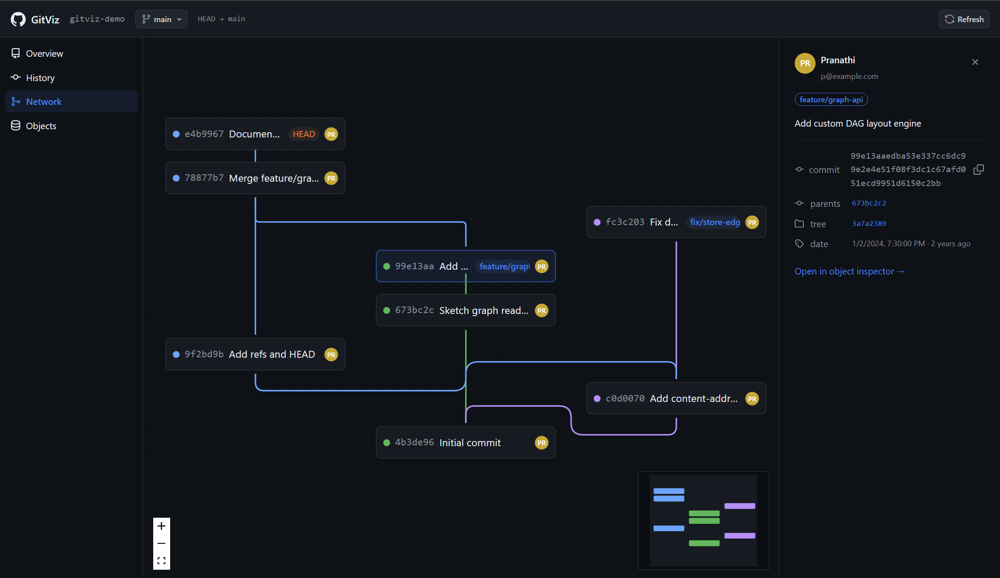
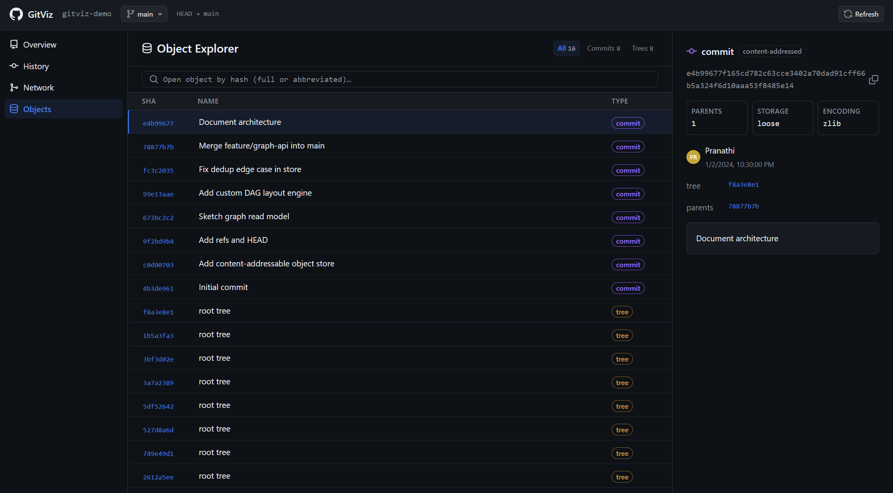

# GitViz

[](https://github.com/Pranathi-Vallamreddy/GitViz/actions/workflows/ci.yml)


### **▶ [Live demo](https://gitviz-web.vercel.app)** &nbsp;·&nbsp; [API health](https://gitviz-api.onrender.com/health)

> **Heads up:** the API runs on a free tier that sleeps when idle — the **first
> request after a while can take ~40s to wake up**. Give it a moment on first load.

A **Git-inspired visual version control system, built from scratch.** GitViz
implements a real content-addressable object store (blobs / trees / commits keyed
by SHA-256), a commit **DAG** with branching, checkout, and merge commits, and an
interactive web client — a GitHub/GitKraken-style tool for exploring a repository,
its commit graph, and its content-addressed objects.

> A from-scratch reimagining, **not a fork of Git** — built to demonstrate systems
> design, data structures, graph algorithms, and full-stack TypeScript engineering.

---

## Screenshots

<!--
  Placeholders — drop real images into docs/screenshots/ with these names and
  they'll render here. A short GIF of the commit graph is the highest-impact one
  for a reviewer skimming the page.
-->

|                    Commit graph (DAG)                    |                       Object inspector                       |
| :-----------------------------------------------------: | :----------------------------------------------------------: |
|  |  |


---

## Highlights

- **A real Git-style engine, not a wrapper.** SHA-256 content addressing, a zlib
  loose-object store with fan-out directories, dedup, and integrity checks —
  written from first principles with **no I/O framework dependencies**.
- **Commit DAG with branching & checkout.** Symbolic and detached `HEAD`, refs,
  `writeTree`, `commit`, `log`, `graph`, and `checkout`.
- **A custom graph layout engine.** Topological sort + lane assignment turns the
  raw DAG into the drawn commit graph — no off-the-shelf graph-layout library.
- **One engine, three front doors.** The same framework-free core powers a CLI, a
  REST API, and a React web client.
- **Typed end-to-end & tested.** Strict TypeScript across every package with
  ~100 passing unit tests (vitest), enforced in CI.

## Architecture

A TypeScript monorepo (pnpm workspaces + project references):

```
gitviz/
├─ packages/
│  ├─ shared/   @gitviz/shared  — framework-agnostic types & API DTOs
│  ├─ core/     @gitviz/core    — the VCS engine (object store, refs, DAG). No I/O frameworks.
│  ├─ server/   @gitviz/server  — Fastify read-only REST API over the engine
│  └─ web/      @gitviz/web     — React + Vite + Primer + React Flow client
└─ apps/
   └─ cli/      @gitviz/cli     — the `gitviz` command-line client
```

**Engine** (`core`): SHA-256 content addressing, zlib loose-object store with
fan-out + dedup + integrity checks, refs/HEAD (symbolic & detached), `writeTree`,
`commit`, `log`, `graph`, and `checkout`. Fully unit-tested; never imports a web
or server framework.

**API** (`server`, read-only): `GET /health`, `/api/overview`, `/api/graph`,
`/api/objects/:hash` (accepts abbreviated hashes). Points at one repository via
`GITVIZ_REPO` and auto-seeds a demo repo if empty.

**Web** (`web`): a custom DAG layout engine (topological sort + lane assignment)
feeding React Flow, plus Overview / History / Network / Objects views.

## Prerequisites

- Node.js >= 20 (developed on 22)
- pnpm 9 — `corepack enable pnpm` (or run any command via `corepack pnpm@9.15.0 …`)

## Run locally

```bash
pnpm install
pnpm test          # engine + layout tests (vitest)
pnpm build         # build every package

# Two terminals:
GITVIZ_REPO="$HOME/gitviz-demo" pnpm dev:server   # API on :3000 (auto-seeds a demo repo)
pnpm dev:web                                       # web on :5173 (proxies /api → :3000)
```

Open **http://localhost:5173**. Point the API at a real repo by setting
`GITVIZ_REPO` to any folder you've run `gitviz init` / `gitviz commit` in (and set
`GITVIZ_SEED=false` to skip the demo seed). Try the CLI with `pnpm cli -- --help`.

## Deploy

Web on **Vercel**, API on **Render** (both free tiers, no Docker needed). Configs
are checked in (`vercel.json`, `render.yaml`).

**1. Push to GitHub** (already the `origin` remote).

**2. API → Render.** New → **Blueprint** → pick this repo. `render.yaml` provisions
a Node web service that builds the engine + server and auto-seeds a demo repo.
Copy its URL, e.g. `https://gitviz-api.onrender.com`, and confirm
`https://…/health` returns `{"status":"ok"}`.

**3. Web → Vercel.** New Project → import this repo (Vercel reads `vercel.json`).
Add an environment variable **`VITE_API_URL`** = the Render URL from step 2, then
deploy. Open the Vercel URL — it will load the demo repo from your API.

CORS defaults to `*` for a public read-only demo; tighten `CORS_ORIGIN` on Render
to your Vercel domain if you prefer. For a container host (Fly.io/Railway) instead
of Render, a `Dockerfile` is included.

## Status

Feature-complete engine, REST API, CLI, and web client with ~100 passing tests,
verified in CI on every push and pull request.
Not implemented (by design): diffs, remotes/push/pull, and multi-repo.
